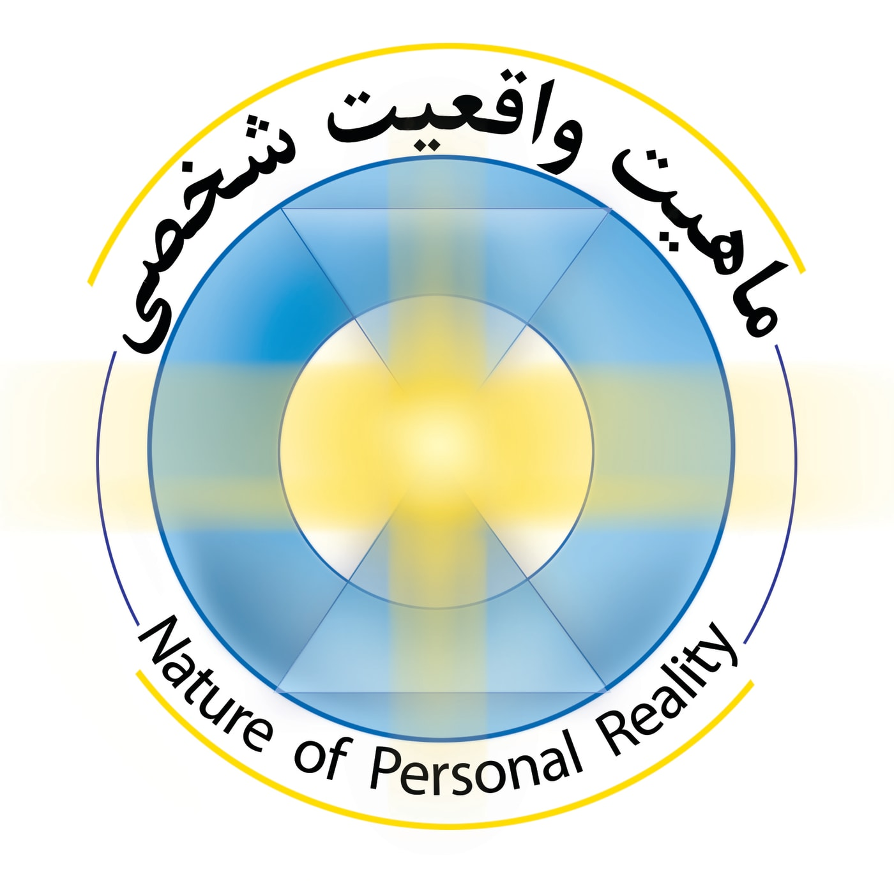

ماهیت واقعیت شخصی
=================

کتابی از سِت/جین رابرتز/رابرت باتز
----------------------------------

پرسش‌گری و بی‌قراری جین رابرتز (1929-1984) سرانجام در میانه‌های مسیر زندگی، منجر به برقراری ارتباط او با سِت می‌شود که که یک آگاهی غیرمتمرکز بر دنیای فیزیکی و مادی، و به قول خودش یک معلم است، هرچند تجارب زندگی‌های زمینی را نیز پشت سر گذاشته است. ادامه این ارتباط منجر به تولید کتاب‌هایی می‌شود که ماهیت واقعیت شخصی، دومین آنها، و از دید بنده که برای اولین بار این کتاب را به فارسی ترجمه کرده‌ام، مهم‌ترین آنهاست. در واقع، اهمیت و ضرورتی که در انتقال این آموزه‌ها به جامعه امروز احساس کردم مرا برای تلاش در این مسیر مصمم کرد.

هستۀِ اساسی کتابِ ماهیت واقعیت شخصی، تاکید بر روی باورها و کار کردن با آنها، به عنوان شکل‌دهنده افکار، احساسات و تمام آن واقعیتی است که با آن مواجه می‌شوید. در نهایت این تغییرات رویکرد در مورد باورهای محدودکننده، جنبه‌های بسیاری از زندگی بشر امروزی را تحت تاثیر قرار می‌دهد که در کتاب مورد بحث قرار گرفته‌اند، که از میان آنها می‌توان به باورها در حوزه سلامت، سیستم درمانی، مواد مخدر، جرم و جنایت و سیستم قضایی، برخورد با سالمندان، خیر و شر، جنگ‌ها، عالم رویا، آب و هوا و فجایع طبیعی، عشق و ... اشاره کرد. به باور مترجم، جاری شدن چنین آموزه‌هایی به شکل جمعی در جامعه انسانی، شکل دنیا را به کلی و به نحوی غیر قابل تصور تغییر خواهد داد، و این، همان شکل دنیای آینده است.

`ماهیت-واقعیت-شخصی` `ست` `جین رابرتز` `رابرت باتز`

Nature of personal reality
==========================

A book by Seth/Jane Roberts/Robert Butts
----------------------------------------

The questioning and restlessness of Jane Roberts (1984-1929) eventually led her to connect with Seth, a non-centered consciousness on the physical and material world, and a teacher in her own words, although she also had the experiences of earthly lives behind her. has left The continuation of this relationship leads to the production of books, the second of which is the nature of personal reality, and from my point of view, who has translated this book into Persian for the first time, it is the most important of them. In fact, the importance and necessity that I felt in transferring these teachings to today's society made me determined to try in this direction.

The essential core of the book The Nature of Personal Reality is the emphasis on beliefs and working with them as the shapers of thoughts, feelings and all of the reality you encounter. Finally, these changes in approach to limiting beliefs affect many aspects of human life today that are discussed in the book, including beliefs in health, the health care system, drugs, crime, and He mentioned the judicial system, dealing with the elderly, good and evil, wars, dream world, weather and natural disasters, love, etc. According to the translator, the flow of such teachings in a collective form in human society will change the shape of the world completely and in an unimaginable way, and this is the shape of the future world.

`The nature of personal reality` `Seth` `Jane Roberts` `Robert Butts`

برای تهیه کتاب می‌توانید به کانال تلگرامی که برای همین منظور راه انداخته‌ام و لینکش را در انتها قرار می‌دهم مراجعه بفرمایید. جستجوی عبارت "ماهیت واقعیت شخصی" از داخل خود تلگرام هم راه دیگری برای ورود به کانال خواهد بود. امیدوارم در این مسیر، با هم همراه شویم!

[پیوستن به کانال تلگرام ماهیت واقعیت شخصی](https://t.me/NaoPeRe/3)
